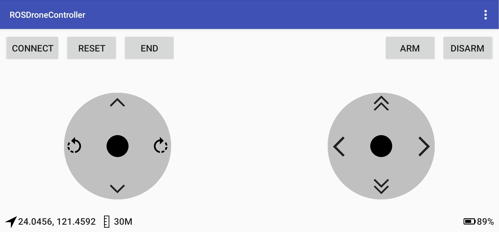

# ROSDroneController

Application that connects to a ROS instance and sends movement instructions via TCP.

UI consists of a joystick interface, where each movement area is mapped to an specific command that is then sent as a String for the ROS instance to further process it accordingly.

